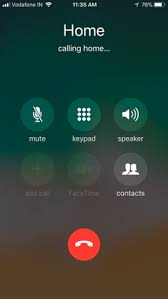

#Welcome to the Stitch Workshop on How to Make a Nexmo's In-App Voice Call with Apple's iOS CallKit 

In this workshop learn how your Nexmo In-App Voice integrations can use Apple's CallKit for system-level phone functionalities such as dial pad, call or hangup. 

Note: CallKit features do work in the simulator. In order to follow along with this tutorial, you’ll need an iPhone with iOS 11 installed.

## What is Nexmo In-App Voice

Nexmo In-App Messaging, In-App Voice, and In-App Video is part of a single, conversation centric API offered by Nexmo, the Vonage API Platform. Nexmo In-App Voice leverages the rising power of WebRTC to enable developers and builders of all kinds to create and deliver fully programmable, feature rich voice applications and experiences across the cloud. 

### Concepts 

There are just a few key concepts. These are: 

- __Conversation__

A conversation is a shared core component that Nexmo APIs rely on. Conversations happen over multiple mediums and and can have associated Users through Memberships.

- __User__

The concept of a user exists in Nexmo APIs, you can associate one with a user in your own application if you choose. A user can have multiple memberships to conversations and can communicate with other users through various different mediums.

- __Member__

Memberships connect users with conversations. Each membership has one conversation and one user however a user can have many memberships to conversations just as conversations can have many members.

- __Audio__

Audio streams can be enabled and disabled in a Conversation so that Members can communicate with voice.

- __Media Events__

Media events will fire in a Conversation when media state changes for a member. This can be when an Audio stream is started or ended.

### Goal

In this workshop we use all of the concepts that are key to Nexmo In-App Voice for initiating a call with Apple's iOS CallKit.  

## What is Apple's CallKit

CallKit is a relatively new framework that facilitates integrations like Nexmo's In-App Voice for rich VoIP experiences with the iPhone/iPad's native calling UI. Integrations with Apple's CallKit use Apple's own incoming call screen in both locked / unlocked states, allowing end users to initiate Nexmo In-App Voice calls from an iPhone app’s Contacts, Favorites or Recents screens. 




## Getting Started 

Download the starter project [here](). To get the app up and running on your localhost, you follow the directions for the server [here](). After you are able to get up and running, test out your setup by creating a member, joining a conversation and triggering an event. If everything worked out well, you are all setup now! 


### Make an Outgoing Call 

A user can initiate an outgoing call with a VoIP app in any of the following ways:
- Performing an interaction within the app
- Opening a link with a supported custom URL scheme
- Initiating a VoIP call using Siri

To make an outgoing call, an app requests a `CXStartCallAction` object from its `CXCallController` object. The action consists of a UUID to uniquely identify the call and a `CXHandle` object to specify the recipient.

```Swift 
let uuid = UUID()
let handle = CXHandle(type: .emailAddress, value: "jappleseed@apple.com")
 
let startCallAction = CXStartCallAction(call: uuid)
startCallAction.destination = handle
 
let transaction = CXTransaction(action: startCallAction)
callController.request(transaction) { error in
    if let error = error {
        print("Error requesting transaction: \(error)")
    } else {
        print("Requested transaction successfully")
    }
}
```


## Resources 
- [CallKit Tutorial for iOS](https://www.raywenderlich.com/701-callkit-tutorial-for-ios) 
- [Apple's CallKit Documentation](https://developer.apple.com/documentation/callkit)
- [Apple's Voice Over IP (VoIP) Best Practices](https://developer.apple.com/library/archive/documentation/Performance/Conceptual/EnergyGuide-iOS/OptimizeVoIP.html#//apple_ref/doc/uid/TP40015243-CH30-SW1)


